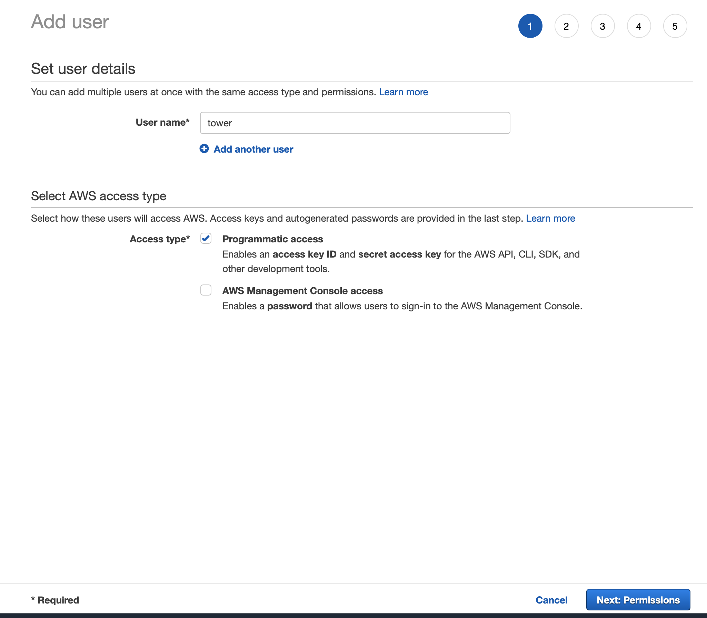
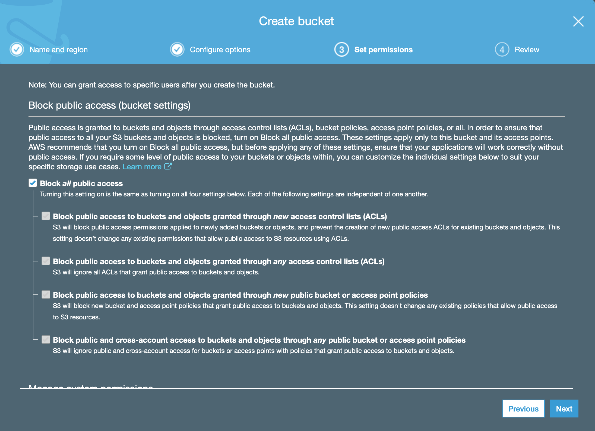
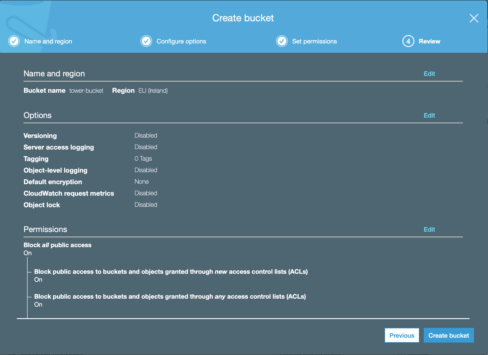
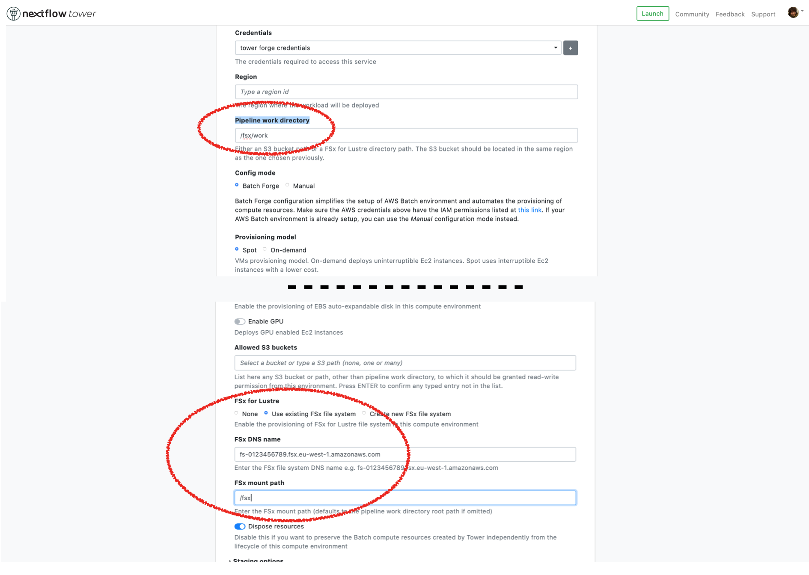
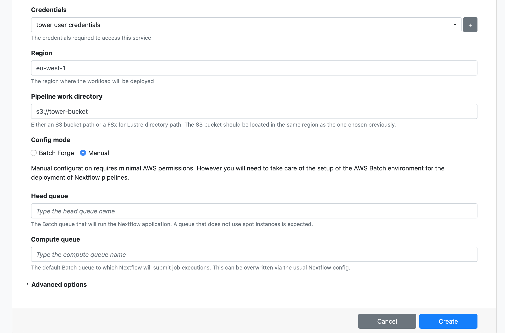
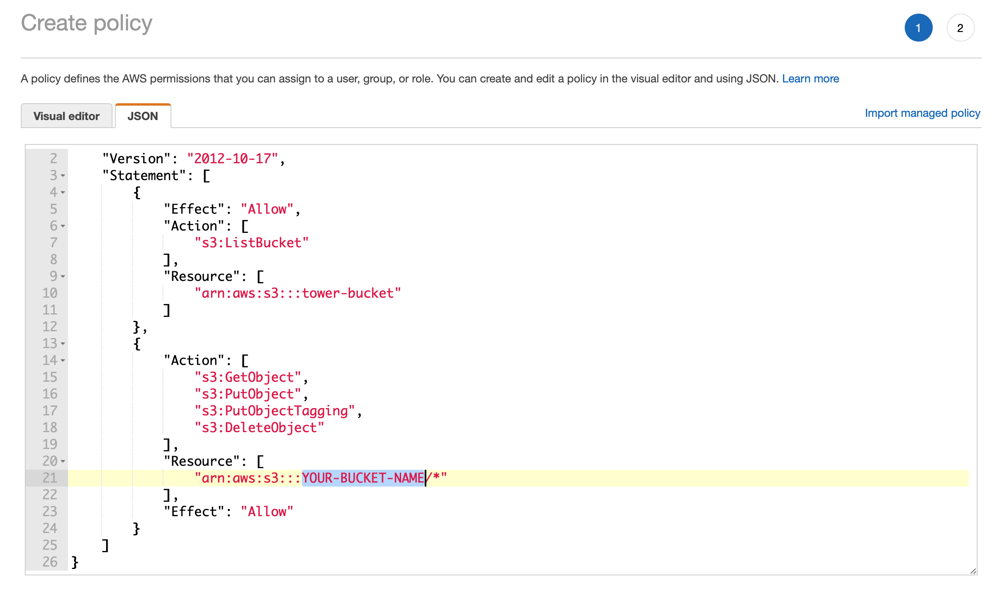

## Overview
!!! note "Disclaimer"
    This guide assumes you have an existing [AWS Account](https://aws.amazon.com/). Sign up for a free AWS account [here](https://portal.aws.amazon.com/billing/signup).

There are two ways to create a **Compute Environment** for **AWS Batch** with Tower.

1. **Tower Forge** for AWS Batch automatically creates AWS Batch resources in your AWS account.

2. **Tower Launch** allows you to create a compute environment using existing AWS Batch resources.

If you don't yet have an AWS Batch environment fully set-up, following the [Tower Forge](#forge) guide is suggested. If you have been provided with an AWS Batch queue from your account administrator, or if you have set up AWS Batch previously, follow the [Tower Launch](#manual) guide.

## Forge

!!! warning
    Follow these instructions if you have not pre-configured an AWS Batch environment. Note that this will create resources in your AWS account that you may be charged for by AWS.

Tower Forge automates the configuration of an [AWS Batch](https://aws.amazon.com/batch/) compute environment and queues required for the deployment of Nextflow pipelines.

## Forge AWS Resources

### IAM User Permissions

To use the Tower Forge feature, Tower requires an IAM user with the permissions listed in this [policy file](https://github.com/seqeralabs/nf-tower-aws/blob/master/forge/forge-policy.json). These permissions are more permissive than those required to only launch a pipeline as Tower needs to create AWS resources on your behalf.

The steps below will guide you through the creation a new IAM user for Tower and attach the required policy for the newly created user.

**1.** Open the [AWS IAM console](https://console.aws.amazon.com/iam), select **Users** on the left menu and click the **Add User** button on top.

**2.** Enter a name for your user (e.g. `tower`) and choose the **Programmatic access** type. Then select the **Next: Permissions** button.

**3.** Now perform the following steps: click on the **Next: Tags** button, **Next: Review** and **Create User**.

!!! warning  "This user has no permissions"
     For the time behing, you can ignore the warning, we will address this later using an **IAM Policy**.

**4.** Save the **Access key ID** and **Secret access key** in a secure location. We will use these in the [next section](#forge-compute-environment). Press the **Close** button.

**5.** Back in the users table, select the newly created user and click **+ Add inline policy** to add user permissions.

**6.** Choose JSON and copy the content of the [policy linked above](https://github.com/seqeralabs/nf-tower-aws/blob/master/forge/forge-policy.json).

**7.** Select the **Review policy** button, name your policy (e.g. `tower-forge-policy`), and confirm the operation by clicking on the **Create policy** button.

!!! tip "What permissions are required?"
    This policy includes the minimal permissions required to allow the user to submit jobs to AWS Batch, gather the container execution metadata, read CloudWatch logs and access data from the S3 bucket in your AWS account in read-only mode.

### Creating an S3 Bucket for Storage

Next up we need to create an **S3 Bucket** to access files and store results for our pipelines. S3 stands for Simple Storage Service and is a type of **object storage**.

We must grant our new Tower IAM user access to this bucket.

**1.** Navigate to the [S3 service](https://console.aws.amazon.com/s3/home) and select **Create New Bucket**.

**2.** Enter a unique name for your Bucket and select a region.

!!! warning "Which AWS region should I use?"
    The region of the bucket should be in the same region as the compute environment which we will set in the next section. Typically users select a region closest to their physical location but Tower Forge supports creating resources in any of the available AWS regions.

**3.** Select the default options for **Configure options**.

**4.** Select the default options for **Set permissions**.

**5.** Review the bucket and select **Create bucket**.

  !!! warning "S3 Storage Costs" 
    S3 is used by Nextflow for the storage of intermediary files. For production pipelines, this can amount to a large quantity of data. To reduce costs, when configuring a bucket, users should consider management options such as the ability to automatically delete these files after 30 days.

## Forge compute environment

!!! note "Awesome!"
    You have completed the AWS environment setup for Tower.

Now we can add a new **AWS Batch** environment in the Tower UI. To create a new compute environment, follow these steps:

**1.** In a workspace choose "Compute environments" and then, click on the **New Environment** button.

**2.** Enter a descriptive name for this environment. For example, *AWS Batch Spot (eu-west-1)* and select **Amazon Batch** as the target platform.

**3.** Add new credentials by selecting the **+** button. Choose a name, e.g. *AWS Credentials* and add the Access key and Secret key. These are the keys we saved in the previous steps when creating the AWS IAM user.

!!! tip "Multiple credentials"
    You can create multiple credentials in your Tower environment.

**4.** Select a **Region**. For example *eu-west-1 - Europe (Ireland)*, and in the **Pipeline work directory** enter the S3 bucket we created in the previous section e.g: `s3://unique-tower-bucket`.

**5.** Select **Batch Forge** as the **Config Mode**.

!!! warning
    The bucket should be in the same **Region** as selected above.

**6.** Choose a **Provisioning model**. In most cases this will be *Spot*.

!!! tip "Spot or On-demand?"
    You can choose to create a compute environment that will launch either **Spot** or **On-demand** instances. **Spot instances can cost as little as 20% of on-demand instances** and with Nextflow's ability to automatically relaunch failed tasks, Spot is almost always the recommended provisioning model.
    Note however that when choosing *Spot* instances, Tower will also create a dedicated queue for running the main Nextflow job using a single on-demand instance in order to prevent any execution interruptions.

**7.** Enter the **Max CPUs** e.g. `64`. This is the maximum number of combined CPUs (the sum of all instances CPUs) AWS Batch will launch at any time.

**8.** Choose **EBS Auto scale** to allow the EC2 virtual machines to expand the amount of available disk space during task execution.

**9.** With the optional **Enable Fusion mounts** feature enabled, S3 buckets specified in the **Pipeline work directory** and **Allowed S3 Buckets** fields will be mounted as file system volumes in the EC2 instances carrying out the Batch job execution. These are then accessible at the path location with the pattern `/fusion/s3/BUCKET_NAME`.
For example if the bucket name is `s3://imputation-gp2` the Nextflow pipeline will access it using the file system path `/fusion/s3/imputation-gp2`.

!!! tip
    Note that's not required to modify your pipeline or files to take advantage of this feature. Nextflow is able to recognise these buckets will automatically replace any reference to s3:// prefixed files with the corresponding Fusion mount paths.

**10.** Choose **Enable GPUs** to allow the deployment of GPU enabled EC2 virtual machines if required.

**11.** Enter any additional **Allowed S3 buckets** that your workflows require to read input data or to write output files. The **Pipeline work directory** bucket above is added by default to the list of **Allowed S3 buckets**.

**12.** To use **FSx**, you can enter `/fsx` as the **FSx mount path** and set the **Pipeline work directory** above to be `/fsx/work`

**13.** Choose the **Dispose resources** option.

**Advanced options**

!!! warning "AMI ID - AMI requirements for AWS Batch use"
    To use an existing AMI, make sure the AMI is based on an Amazon Linux-2 ECS optimized image that meets the Batch requirements. To learn more about approved versions of the Amazon ECS optimized AMI, visit this [link](https://docs.aws.amazon.com/batch/latest/userguide/compute_resource_AMIs.html#batch-ami-spec)

!!! warning "Min CPUs - Editing this will result in additional AWS costs" 
    Keeping EC2 instances running may result in additional costs. You will be billed for these running EC2 instances regardless of whether you are executing pipelines or not.

Note that if **Min CPUs** is greater than `0`, EC2 instances will remain active. An advantage of this is that a pipeline execution will initialize faster but it may have additional costs.

**14.** If you're using the `Spot instances` then you could also specify the `Cost percentage` to determine the maximum percentage that a `Spot instance` price can be when compared with the `On-Demand` price for that instance type before instances are launched

 

**15.** Select **Create** to finalize the compute environment setup. It will take approximately 60 seconds for all the resources to be created and then you will be ready to launch pipelines.

 

!!! note "Amazing!"
    You now have everything you need to begin deploying massively scalable pipelines.

Jump to the documentation section for [Launching Pipelines](/docs/launch/overview/).

## Manual

This section is for users with a pre-configured AWS environment. You will need a Batch queue, Batch compute environment, an IAM user and an S3 bucket already set up.

To enable Tower within your existing AWS configuration, you need to have an IAM user with the following IAM permissions:

- `AmazonS3ReadOnlyAccess`
- `AmazonEC2ContainerRegistryReadOnly`
- `CloudWatchLogsReadOnlyAccess`
- A [custom policy](https://github.com/seqeralabs/nf-tower-aws/blob/master/launch/launch-policy.json) to grant the ability to submit and control Batch jobs.
- Write access to any S3 bucket used pipeline work directories with the following [policy template](https://github.com/seqeralabs/nf-tower-aws/blob/master/launch/s3-bucket-write.json). See [below for details](#access-to-s3-buckets)

With these permissions set, we can add a new **AWS Batch** environment in the [Tower UI](#launch-compute-environment)

## Manual compute environment
To create a new compute environment for AWS Batch (Manual):

**1.** In a workspace choose "Compute environments" and then, click on the **New Environment** button.

**2.** Choose a descriptive name for this environment. For example "AWS Batch Launch (eu-west-1)" and Select **Amazon Batch** as the target platform

 

**3.** Add new credentials by clicking the "+" button. Choose a name, add the **Access key** and **Secret key** from your IAM user.

 

!!! tip "Multiple credentials"
    You can create multiple credentials in your Tower environment. See the section **Credentials Management**.

**4.** Select a region, for example "eu-west-1 - Europe (Ireland)"

**5.** Enter an S3 bucket path, For example "s3://tower-bucket"

**6.** the **Manual** config mode.

**7.** Enter the **Head queue** which is the name of the AWS Batch queue that the Nextflow driver job will run and a **Compute queue** which is the name of the AWS Batch queue that tasks will be submitted to.

**8.** Select **Create** to finalize the compute environment setup.

 

!!! note "Awesome!"
    You now have created a compute environment.

### Access to S3 Buckets

Tower can use S3 to access data, create work directories and write outputs. The IAM user above needs permissions to use these S3 Buckets. We can set a policy for our IAM user that provides the permission to access specific buckets.

**1.** Access the IAM User table in the [IAM service](https://console.aws.amazon.com/iam/home)

**2.** Select the IAM user.

**3.** Select **+ add inline policy**.

 

**4.** Select JSON and copy the contents of [this policy](https://github.com/seqeralabs/nf-tower-aws/blob/master/launch/s3-bucket-write.json). Replace lines 10 and 21 with your bucket name.

 

**5.** Name your policy and click **Create policy**.

!!! note "Amazing!"
    You now have everything to begin deploying massively scalable pipelines.

Jump to the documentation section for [Launching Pipelines](../../launch/overview/).
