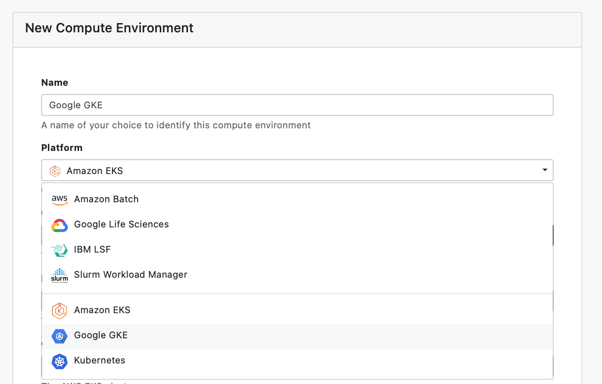
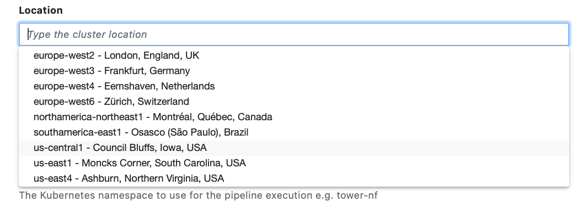

## Overview

[Google GKE](https://cloud.google.com/kubernetes-engine) is a managed Kubernetes cluster that allows the execution of containerized workloads in Google Cloud at scale.

Nextflow Tower offers native support for Google GKE clusters and streamlines the deployment of Nextflow pipelines in such environments.

## Requirements

You need to have a GKE cluster up and running. 

Make sure you have followed the steps in the [Cluster preparation](https://github.com/seqeralabs/nf-tower-k8s) guide to create the cluster resources required by Nextflow Tower.

## Compute environment setup

**1.** In a workspace choose "**Compute environments**" and then, click on the **New Environment** button.

**2.** Enter the **Name** for this environment, for example, *My GKE*.

**3.** Select **Google GKE** as the target platform.

**4.** Select your Google Cloud credentials. The credentials are needed to identify the user that will access the GKE cluster.

**5.** Select the **Location** where the GKE cluster is located.

!!! warning "Regional and zonal clusters" 
    GKE clusters can be either *regional* or *zonal*. For example, `us-west1` identifies the United States West-Coast region, which has three zones: `us-west1-a`, `us-west1-b`, and `us-west1-c`.
     
    Tower self-completion only shows regions. You should manually edit this field if your GKE cluster was created by zone rather than regionally.
     

**6.** The field **Cluster name** lists all GKE clusters available in the selected location. Choose the one you want to use to deploy the Nextflow execution.

**7.** Specify the Kubernetes **Namespace** that should be used to deploy pipeline executions.

If you have followed the example in the [cluster preparation](https://github.com/seqeralabs/nf-tower-k8s/blob/master/cluster-preparation.md#2-service-account--role-creation) guide, this field should be `tower-nf`.

**8.** Specify the Kubernetes **Head service account** that will be used to grant permissions to Tower to deploy the pods executions and related.

If you have followed the [cluster preparation](https://github.com/seqeralabs/nf-tower-k8s/blob/master/cluster-preparation.md#2-service-account--role-creation) guide, this field should be `tower-launcher-sa`.

**9.** The **Storage claim** field allows you to specify the storage Nextflow should use as a scratch file system for the pipeline execution.

This should reference a Kubernetes persistence volume with `ReadWriteMany` capability. Check the [cluster preparation](https://github.com/seqeralabs/nf-tower-k8s/blob/master/cluster-preparation.md#3-storage-configuration) guide for details.

**10.** You can specify certain environment variables on the Head job or the Compute job using the **Environment variables** option.

## Advanced options

The following parameters are available:

**1.** The **Storage mount path** defines the file system path where the Storage claim is mounted. 

Default: `/scratch`

**2.** The **Work directory** field defines the file system path used as a working directory by Nextflow pipelines. It must be the same or a subdirectory of the *Storage mount path* at the previous point. 

Default: the same as *Storage mount path*.

**3.** The  **Compute service account** field allows you to specify the Kubernetes *service account* that the pipeline jobs should use. 

Default is the `default` service account in your Kubernetes cluster.

**4.** The pod behavior within the cluster could be controlled by using the **Pod cleanup policy** option.

**5.** The **Custom head pod specs** field allows you to provide a custom configuration for the pod running the Nextflow workflow e.g. `nodeSelector` and `affinity` constraints. It should be a valid PodSpec YAML structure starting with `spec:`.

**6.** The **Custom service pod specs** field allows you to provide a custom configuration for the compute environment service pod e.g. `nodeSelector` and `affinity` constraints. It should be a valid PodSpec YAML structure starting with `spec:`.

Jump to the documentation section for [Launching Pipelines](../../launch/launchpad/).
