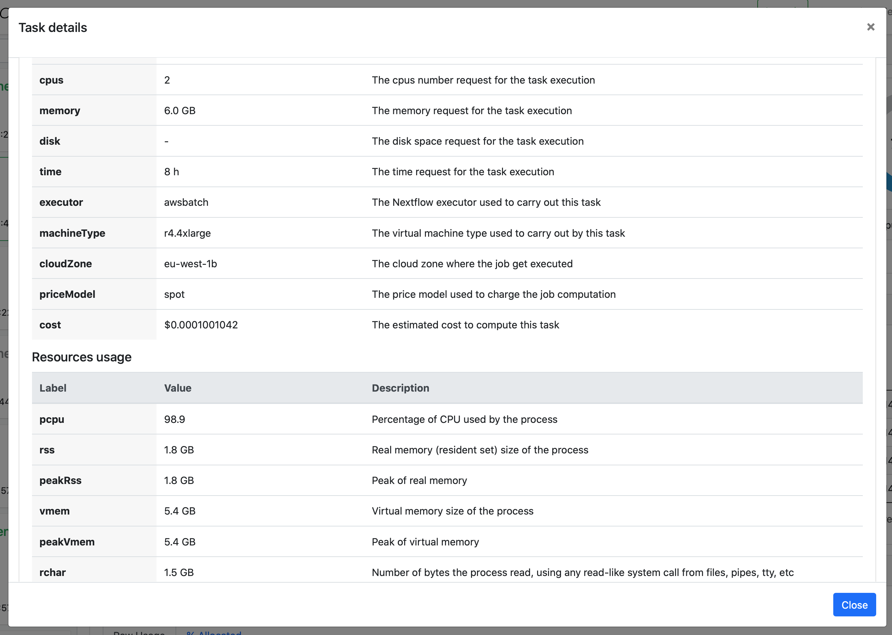
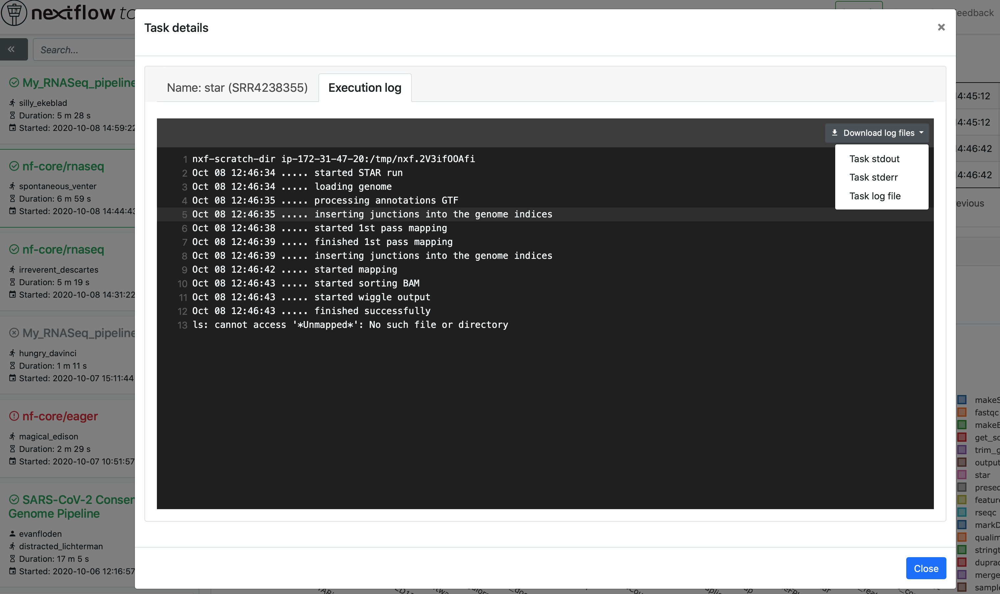

## Task table

The **Tasks** section shows all the tasks from an execution.

You can use the `Search` bar to filter tasks by process name, tag, hash, status, etc. 

Selecting a status in **status** section filters the task table.  E.g. clicking in the _CACHED_ card in the **status** column.

Selecting a `process` in the **Processes** section above will filter all tasks for that specific process.

Selecting a task in the task table provides specific information about the task in the **Task details** dialog. 

The task details dialog has the task information tab and the task **Execution log** tab.

### Task information

The task information tab contains the process name and task tag in the title. The tab includes:

 - Command 
 - Status
 - Work directory
 - Environment
 - Execution time
 - Resources requested
 - Resources used

### Execution log

The **Execution log** provides a realtime log of the individual task of a Nextflow execution. 

This can be very helpful for troubleshooting. It is possible to download the log files including `stdout` and `stderr` from your compute environment.

## Resource metrics

This section displays plots with CPU, memory, task duration and I/O usage, grouped by process.

These metrics can be used to profile an execution to ensure that the correct amount or resources are being requested for each process.

!!! tip 
    Hover the mouse over the box plots to display more details.
